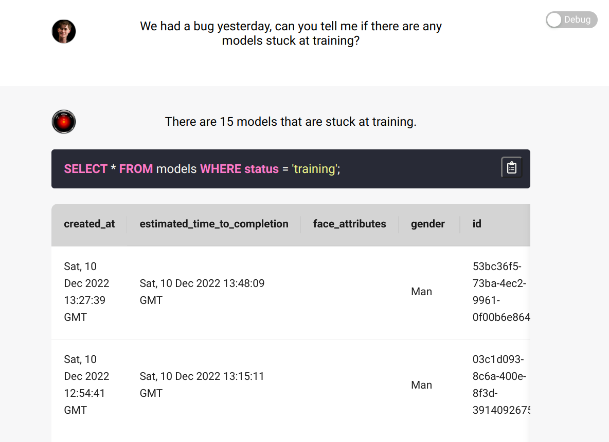
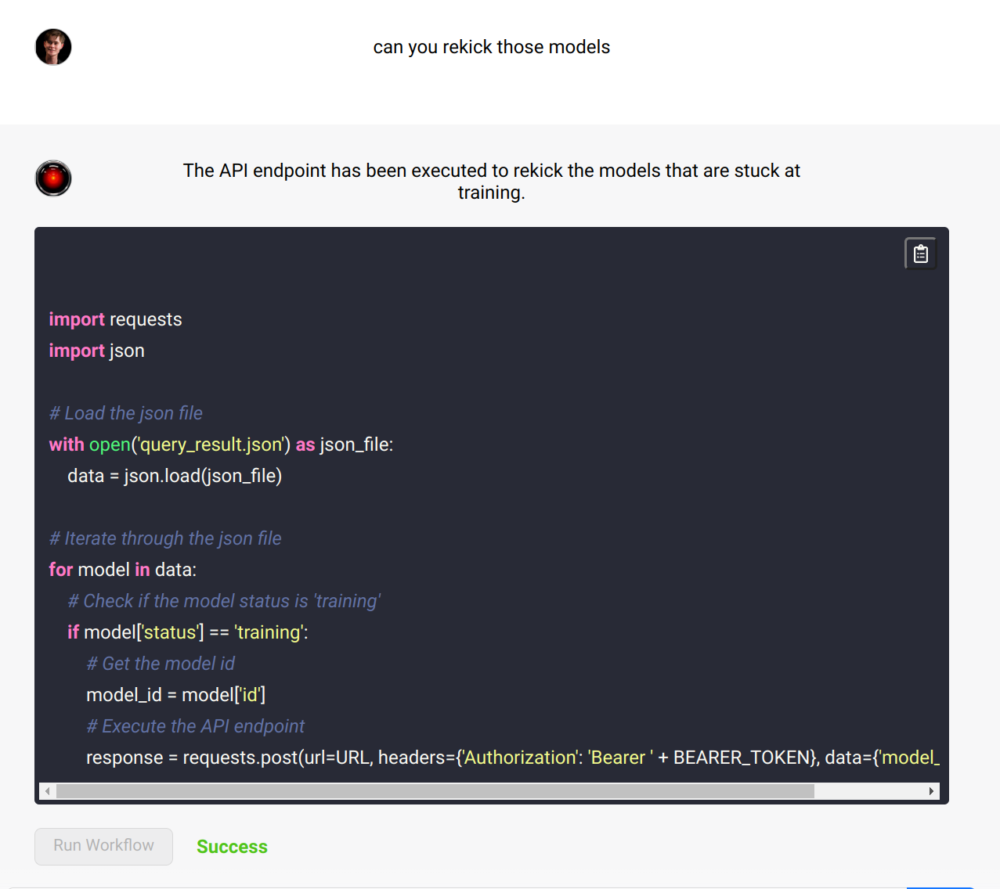

# query-god
QueryGod lets you interact with any API or database using natural language. Writing simple prompts you can chain together the execution of any SQL query and API call.

[Demo Video](https://www.youtube.com/watch?v=mB6l7RUPxy0)

## Inspiration

Last week while working on an AI image generation app, some of our users were stuck in training. After manually trying to find which users were affected, we had an idea. What if we could ask a powerful LLM to read our database, find which users are affected and then run the code to kick-start the model for these users? We quickly learned that having an LLM interact with both Databases and APIs is difficult. The first problem we encountered was that databases are way too large for the token limits of the LLM. The second problem is that current LLMs fail at simple calculations. To solve these problems we applied the reason act framework to build an application that can interact with any API and Database. 

## What it does

You can use LLMs to interact with an API or database. Basically ChatGPT that can execute code. It’s like Retool but in natural language. You can ask questions about your database or execute tasks using the API or different services. This could be the main tool for a lot of people in a company from customer support, sales to software engineers. Right now it requires a technical ability to use, but soon it will be possible to simplify it so that it can execute prebuilt workflows rather than run arbitrary code. 

## How we built it
We used OPEN AI GPT-3 (`text-davinci-003`), [LangChain](https://langchain.readthedocs.io/en/latest/index.html), with a library of 20  prompts. Frontend is react and backend is flask.
## Challenges we ran into
To execute API call and SQL queries in a realistic environment, the LLM needs to know the database schema and API definitions. However, this information does not fit into the 4000 token limit of GPT `text-davinci-003`. So we designed a dynamic hierarchical context management system.
On the top level, we use a memory enhanced Reason & Act ([Yao et. al. 2022](https://arxiv.org/abs/2210.03629)) model that can delicate tasks to specialized language chains. Eg. A specialized API language chain has the API definitions as a context but does not know the details about the database or the entire history of the user conversations.

## Accomplishments that we're proud of
The AI is able to detect problems if it makes a mistake with the SQL query and will adapt it’s query or request if it gets errors
We’ve built a huge library of prompts each of them specialised to a SQL, API or specific endpoints
Running multiple language models that are talking to each other was hard to pull off. We implemented a paper from CMU that we’ve been talking about with other graduate students.
Staying up two nights in a row is something I’ve never done before…

## What we learned
We have asked other graduate students at Harvard what they think about QueryGod and they all wanted to use it. Initially we thought of QueryGod to be a power tool for software developers but our  friends in Data Science were really excited about how efficient QueryGod could allow them to interact with their datasets. 

We also learned the power of prompt engineering. In the beginning all our results were terrible. 

## What's next for QueryGod
we want to integrate more APIs to see how many processes we can automate
Add the ability to edit / and manipulate any CSV using our tool
In the long run we want to explore the potential to create Retool which functions only with Natural Language prompts. This would enable non-technical people to boost their productivity.
